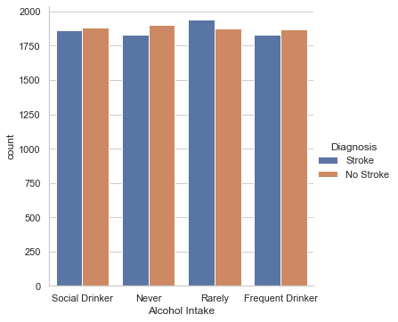
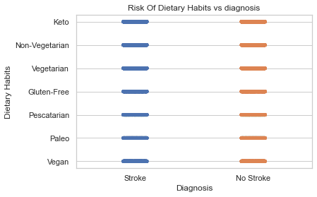

# stroke-disease-prediction

## Introduction

## Notebook Structure
1. Life Cycle of Machine learning
2. Libraries and Dependencies
3. Data Staging
4. Data Checks to perform
5. Exploratory Data Analysis
6. Feature Selection
7. Data Visualization
8. Model Training
9. Model Selection

## Business Understanding
- Stroke is one of the leading causes of disability and death worldwide, and early prediction can significantly reduce its impact. This project focuses on building a predictive model for stroke risk, providing actionable insights for healthcare providers to improve early detection, prioritize high-risk individuals, and implement targeted interventions.
    ### Business questions 
    1. Who are the individuals most at risk of experiencing a stroke based on their demographic, lifestyle, and clinical characteristics?
    2. Which factors (e.g., age, smoking status, glucose levels, hypertension) are the most significant predictors of stroke?
    3. How accurately can we predict the likelihood of a stroke using the given data?
    4. What preventive actions or healthcare measures can be recommended for high-risk groups?
    5. Can we design a model that is interpretable and can be used effectively by healthcare providers in both high- and low-resource settings?
## Project Overview
- The goal of this project is to develop a machine learning-based stroke prediction model that identifies individuals at high risk of stroke, providing insights to guide preventive healthcare strategies
## Problem statement
- Stroke is a leading cause of death and long-term disability worldwide, placing a significant burden on healthcare systems. Early prediction and intervention can significantly reduce stroke-related mortality and morbidity. This project aims to develop a predictive model to identify individuals at high risk of stroke using demographic, lifestyle, and clinical data. The insights gained could help in creating targeted prevention strategies and optimizing healthcare resources.
## Data Understanding
- we explore the dataset to understand its structure, quality, and relevance to the project.The dataset typically contains various demographic, lifestyle, and clinical factors that influence the likelihood of stroke.

## Data Visualization
- Countplot of people who is currently smoking ,non smoker,or formely not according to the gender.

## Countplot for people based on alcohol intake with stroke diagnosis

## PLot for relations between Diagnosis with Dietary habits

## Conclusions

### Key Risk Factors:

- Age: Older individuals are at higher risk for strokes.
- Smoking: Smokers, especially heavy smokers, are more prone to strokes.
- Hypertension: Prevalent hypertension significantly increases stroke risk.
- Diabetes: Individuals with diabetes are at higher risk.
- Obesity (High BMI): Obesity is a contributing factor to stroke.
- High Cholesterol and Glucose Levels: Elevated levels correlate with a higher stroke risk.
- Lifestyle Factors: Lack of exercise and poor diet can exacerbate these risks.
### Interrelationships:

- Comorbidities like diabetes and hypertension often occur together and amplify stroke risk.
Smoking exacerbates the effects of other conditions, such as hypertension.
### Predictive Models:

- Models such as Decision Tree Classifiers, Random Forest, and Logistic Regression can effectively predict stroke risks based on these factors.
Hyperparameter tuning and cross-validation significantly enhance model accuracy and reliability.
## Recommendations:

1. Public Health Interventions:

Promote smoking cessation programs and educate on the dangers of tobacco use.
Encourage regular blood pressure and glucose level monitoring.
Advocate for a balanced diet and regular physical activity to manage BMI and cholesterol levels.

2. Healthcare Strategies:

Implement early screening programs for high-risk populations (e.g., those with hypertension, diabetes, or a family history of strokes).
Provide preventative medications like blood thinners or antihypertensive drugs for at-risk individuals.

3. Personalized Prevention Plans:

Tailor prevention plans for individuals based on their specific risk factors.
Recommend regular checkups and lifestyle adjustments for high-risk groups.

4. Model Utilization:

Deploy the stroke prediction model in healthcare systems to identify at-risk individuals early.
Regularly update the model with new data to maintain accuracy and account for evolving trends.

5. Awareness Campaigns:

Conduct targeted awareness campaigns highlighting modifiable risk factors such as smoking, diet, and exercise.
Use data-driven insights to address common misconceptions and barriers to prevention.